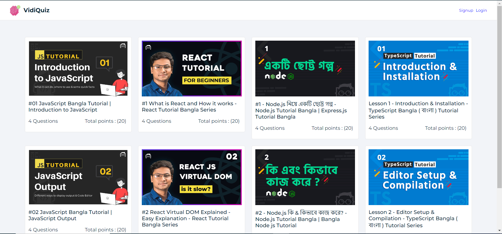
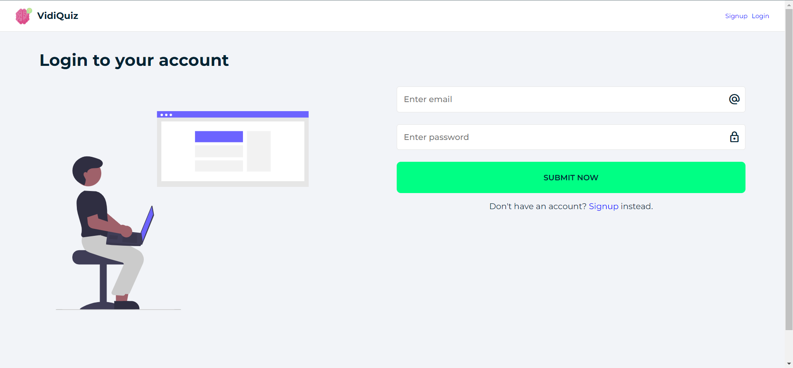
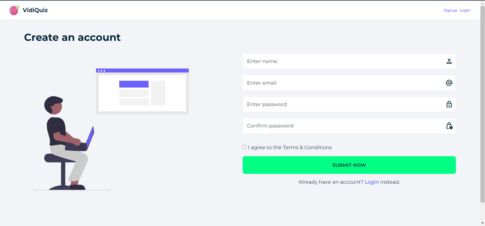
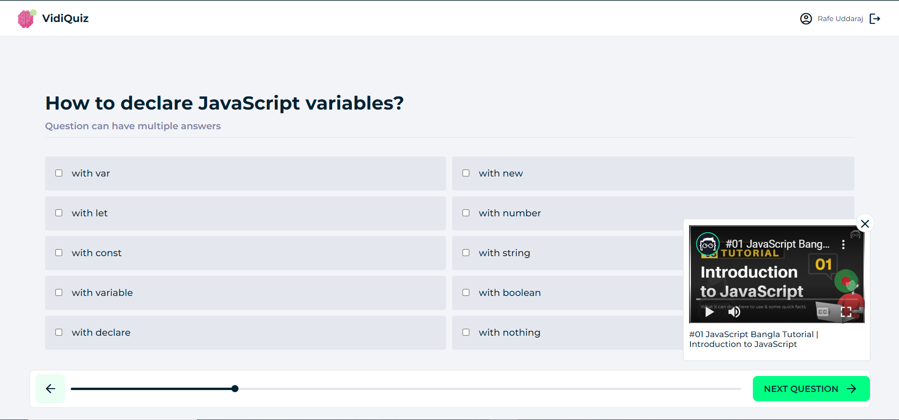
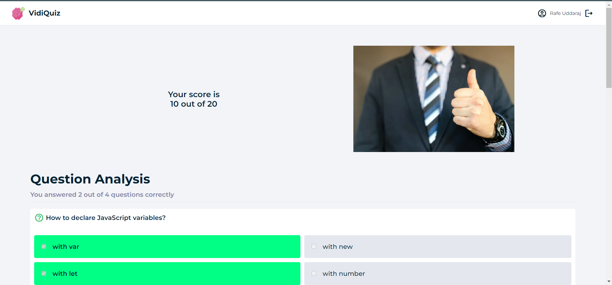
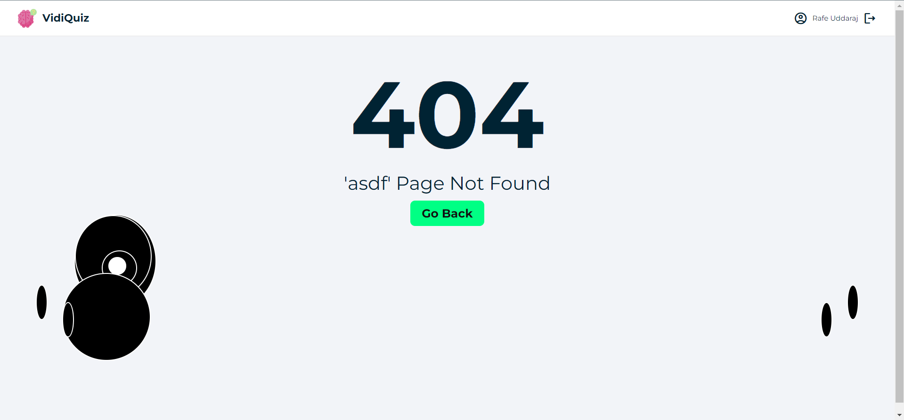

<!-- PROJECT LOGO -->
<br />
<div align="center">
  <a href="https://github.com/github_username/repo_name">
    
  </a>

<h3 align="center">VidiQuiz</h3>

  <p align="center">
    The only purpose of these apps is to play quiz games. There will be videos as well as quizzes set to test your skills after watching the video. So we believe that through this a good output can be brought out from the video content.
    <br />
    <a href="https://github.com/rafeuddaraj/react-quiz"><strong>Explore the docs »</strong></a>
    <br />
    <br />
    <a href="https://vidiquiz.altrazen.com/">View Demo</a>
    ·
    <a href="https://github.com/rafeuddaraj/react-quiz/issues">Report Bug</a>
    ·
    <a href="https://github.com/rafeuddaraj/react-quiz/issues">Request Feature</a>
  </p>
</div>

<!-- TABLE OF CONTENTS -->

<!-- ABOUT THE PROJECT -->

## Quick View

    
<div>
    <div>
        <h3>Home Page</h3>
        
    </div>
    <div>
        <h3>Login Page</h3>
        
    </div>
    <div>
        <h3>Sign in Page</h3>
        
    </div>
    <div>
        <h3>Quiz Page</h3>
        
    </div>
    <div>
        <h3>Result Page</h3>
        
    </div>
    <div>
        <h3>404 Page</h3>
        
    </div>
</div>


## Getting Started

You can easily run this project on your local machine if you want. Follow some steps below

### Prerequisites

You must have node.js installed on your machine. Since we used Firebase as the backend, you need to create a Firebase project.

### Installation

1. <a href=" https://console.firebase.google.com/"> Create Firebase APP</a>

2. Clone the repo
    ```sh
    git clone https://github.com/rafeuddaraj/react-quiz.git
    ```
3. Change Directory
    ```sh
    cd react-quiz
    ```
3. Install NPM packages
    ```sh
    npm install
    ```
4. Create a Environment Variable `.env.local`
    ```env
    VITE_API_KEY=Your_API_KEY
    VITE_AUTH_DOMAIN=Your_AUTH_DOMAIN
    VITE_PROJECT_ID=Your_PROJECT_ID
    VITE_STORAGE_BUCKET=Your_STORAGE_BUCKET
    VITE_MESSAGING_SENDER_ID=Your_MESSAGING_SENDER_ID
    VITE_APP_ID=Your_APP_ID
    VITE_DATABASE_URL=Your_DATABASE_URL
    VITE_PIXELS_API=Your_PIXELS_API
    ```
3. Run project
    ```sh
    npm run dev
    ```